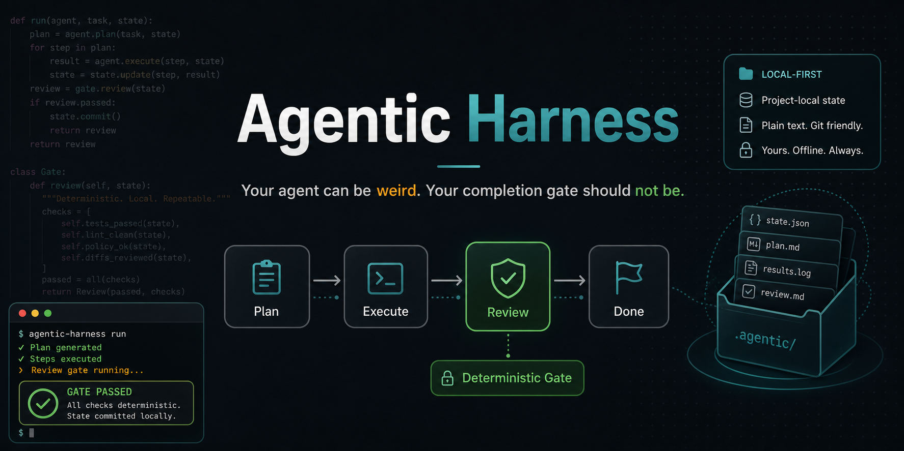

# Agentic Harness



[](https://github.com/moortekweb-art/agentic-harness/actions)
[](https://www.python.org/)
[](LICENSE)
[](https://buymeacoffee.com/moortekweb3)

A small Python harness for running long-lived agent goals without turning your local scripts into a tangled control plane.

Agentic Harness gives you a project-local goal loop: start a goal, execute it through an adapter, save artifacts, run deterministic review, and stop before auto-continue loops get weird.

## Project Links

- [Examples](examples/) include shell, coding-agent, the fix-failing-tests demo, local LLM, tmux, GitHub Actions, and real-world recipe examples.
- [Release checklist](docs/RELEASE_CHECKLIST.md) documents the v0.6.6 release checks.
- [PyPI trusted publishing](docs/PYPI_TRUSTED_PUBLISHING.md) documents the external PyPI setup required for tokenless publishing.
- [Repo artwork](docs/assets/) includes a social preview banner and square icon.
- [Support the project](https://buymeacoffee.com/moortekweb3) via Buy Me a Coffee.
- [Attraction plan](ATTRACTION_PLAN.md) captures public project positioning and follow-up ideas.
- [CI workflow](.github/workflows/ci.yml) runs tests, ruff, mypy, compile smoke checks, package builds, wheel installs, and CLI smoke checks on push and pull requests.

## Quick Start

```bash
pipx install git+https://github.com/moortekweb-art/agentic-harness.git
agentic-harness init
cat > .agentic-harness/config.yml <<'YAML'
version: 1
worker: shell
shell_command:
  - python
  - -c
  - "import os; print('goal:', os.environ['AGENTIC_HARNESS_OBJECTIVE'])"
YAML
agentic-harness start "write a changelog for the last three commits"
agentic-harness continue && agentic-harness review
```

For one-shot local runs:

```bash
agentic-harness run "write a changelog for the last three commits"
```

## Why This Exists

Most agent tooling lands in one of two places:

- Frameworks that are flexible but abstract enough that you still need to build the operational loop yourself.
- Internal scripts that work on one machine, with one naming scheme, one set of paths, and one operator.

Agentic Harness is the middle ground: a small state machine, adapter interface, artifact store, CLI, and deterministic review contract. It is meant for developers who already have useful local tools and want a safer way to run them as repeatable goals.

## How It Works

```text
goal text
   |
   v
pending -> planning -> in_progress -> review -> done
                         |             |
                         v             v
                       failed <----- failed
```

```text
CLI ──> Supervisor ──> Worker adapter ──> local tool / tmux / CI / LLM
          |
          ├── state.json
          ├── markdown reports
          ├── deterministic review result
          └── loop guard
```

The core package has no systemd, Cloudflare, GPU, or server-specific assumptions. Runtime state lives in `.agentic-harness/` inside your project.

## Features

- Deterministic review gates: pass/fail criteria are code, not model vibes.
- Artifact-first execution: every goal writes structured JSON state and review data.
- Loop guard: auto-continue has a project-local circuit breaker persisted at
  `.agentic-harness/guard.json`, so repeated CLI invocations share the same
  safety window.
- State lock and active-goal guard: mutating commands acquire
  `.agentic-harness/state.lock`, and `start` refuses to overwrite an unfinished
  active goal.
- Adapter system: shell, coding-agent CLI, tmux, GitHub Actions, and OpenAI-compatible local LLM adapters are included.
- Local-model friendly: any model served through an OpenAI-compatible chat
  endpoint can be wrapped with deterministic review, including current
  30B-40B local-model experiments such as Ornith 35B.
- Project-local config: no hardcoded absolute paths.
- Small public API: `Goal`, `Supervisor`, and `Worker`.

## Installation

Install as a CLI with pipx:

```bash
pipx install git+https://github.com/moortekweb-art/agentic-harness.git
```

The Python distribution name is `moortek-agentic-harness` so it can be reserved
on PyPI without colliding with the unrelated existing `agentic-harness` package.
The installed CLI command remains `agentic-harness`.

For development:

```bash
git clone https://github.com/moortekweb-art/agentic-harness.git
cd agentic-harness
python -m venv .venv
. .venv/bin/activate
python -m pip install -e ".[test]"
python -m pytest tests/ -q
```

## Usage Examples

See [examples/](examples/) for complete project-local examples with READMEs, safety notes, and expected output.
For the critique-driven demo, see
[examples/fix-failing-tests-demo](examples/fix-failing-tests-demo/).

### Shell Worker

`.agentic-harness/config.yml`

```yaml
version: 1
worker: shell
shell_command:
  - python
  - -c
  - "import os; print('goal:', os.environ['AGENTIC_HARNESS_OBJECTIVE'])"
```

```bash
agentic-harness start "summarize open TODOs"
agentic-harness continue
agentic-harness review
agentic-harness status
```

For a compact operator view instead of JSON:

```bash
agentic-harness status --format text
```

### Local LLM Worker

```python
from agentic_harness import Supervisor
from agentic_harness.adapters import LocalLLMAdapter

worker = LocalLLMAdapter(
    endpoint="http://127.0.0.1:4000/v1/chat/completions",
    model="local-model",
)

supervisor = Supervisor(project_dir=".", worker=worker)
supervisor.start("draft release notes for v0.6.6")
supervisor.continue_goal()
supervisor.review()
```

## Adapters

Adapters implement one method: `run(goal) -> WorkerResult`.

```python
from agentic_harness.core.worker import WorkerResult

class MyWorker:
    def run(self, goal):
        path = f".agentic-harness/runs/{goal.id}/output.txt"
        # call your tool here
        return WorkerResult(success=True, summary="done", artifacts=[path])
```

Then wire it into the supervisor:

```python
from agentic_harness import Supervisor

supervisor = Supervisor(project_dir=".", worker=MyWorker())
```

## Configuration

`agentic-harness init` creates `.agentic-harness/config.yml`.

```yaml
version: 1
worker: noop
```

`noop` is a safe placeholder. It does not pass review by default because no real
worker ran. For a demo-only path, opt in explicitly:

```yaml
version: 1
worker: noop
allow_noop_success: true
```

Shell worker configuration:

```yaml
version: 1
worker:
  type: shell
  shell_command:
    - make
    - agent-goal
```

The shell adapter exposes:

- `AGENTIC_HARNESS_GOAL_ID`
- `AGENTIC_HARNESS_OBJECTIVE`

Coding-agent worker configuration:

```yaml
version: 1
worker:
  type: coding_agent
  coding_agent_command:
    - codex
    - exec
    - --full-auto
    - "{objective}"
  coding_agent_transcript: .agentic-harness/runs/{goal_id}/coding-agent.log
review:
  command:
    - python
    - -m
    - pytest
    - tests/
    - -q
```

Tmux worker configuration:

```yaml
version: 1
worker: tmux
tmux_command: "python worker.py --goal {goal_id}"
tmux_session_prefix: agentic-harness
```

Local LLM worker configuration:

```yaml
version: 1
worker: local_llm
llm_endpoint: http://127.0.0.1:4000/v1/chat/completions
llm_model: local-model
```

GitHub Actions worker configuration:

```yaml
version: 1
worker: github_actions
github_owner: moortekweb-art
github_repo: agentic-harness
github_workflow_id: ci.yml
github_token: token-from-your-secret-store
github_wait: true
github_api_version: 2026-03-10
```

Configuration is intentionally small and strict: unsupported schema versions,
unknown keys, unsupported workers, malformed values, and workers without their
required settings are rejected instead of silently ignored. Config files are
parsed with PyYAML, so flat keys and grouped sections are both supported.

## Review Helpers

The core review module includes small deterministic criteria factories:

```python
from agentic_harness.core import (
    DeterministicReviewer,
    artifact_exists,
    command_passes,
    file_changed,
    git_clean,
)

reviewer = DeterministicReviewer([
    artifact_exists(".", ".agentic-harness/runs/example/report.md"),
    command_passes(["python", "-m", "pytest", "tests/", "-q"]),
    file_changed(".", "CHANGELOG.md"),
    git_clean("."),
])
```

You can also configure common review gates in `.agentic-harness/config.yml`:

```yaml
version: 1
worker:
  type: shell
  shell_command:
    - make
    - agent-goal
review:
  command:
    - python
    - -m
    - pytest
    - tests/
    - -q
  git_clean: true
```

`GitHubActionsAdapter` dispatches workflows by default. Set `github_wait: true`
or `wait_for_completion=True` to wait for the exact workflow run returned by
GitHub's modern workflow dispatch API. Older GitHub API responses that do not
return a run URL fall back to polling workflow_dispatch runs created after the
dispatch request.

## Public API

```python
from agentic_harness import Goal, Supervisor, Worker
```

## Contributing

Issues and pull requests are welcome. Good first contributions:

- Add adapter examples for common local coding agents.
- Improve the deterministic review helpers.
- Improve examples for common local workflows.
- Write docs for running the harness in a small team.

Keep the core small. If a feature assumes a particular server, model provider, or operator workflow, it probably belongs in an adapter or example.

## License

MIT. Copyright (c) 2026 Michael / Moortekweb. See [LICENSE](LICENSE) and
[AUTHORS.md](AUTHORS.md).
