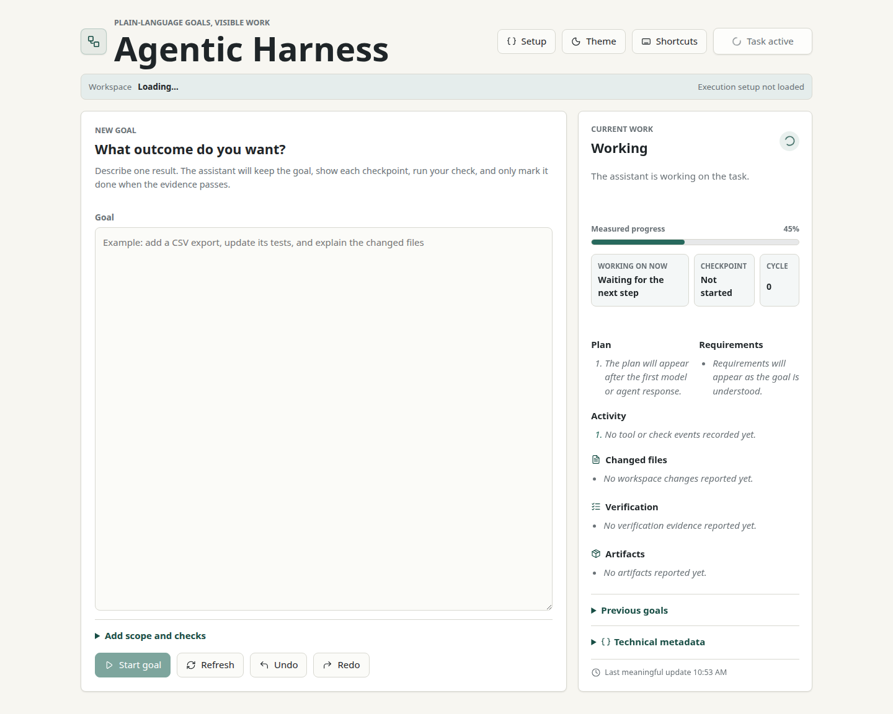
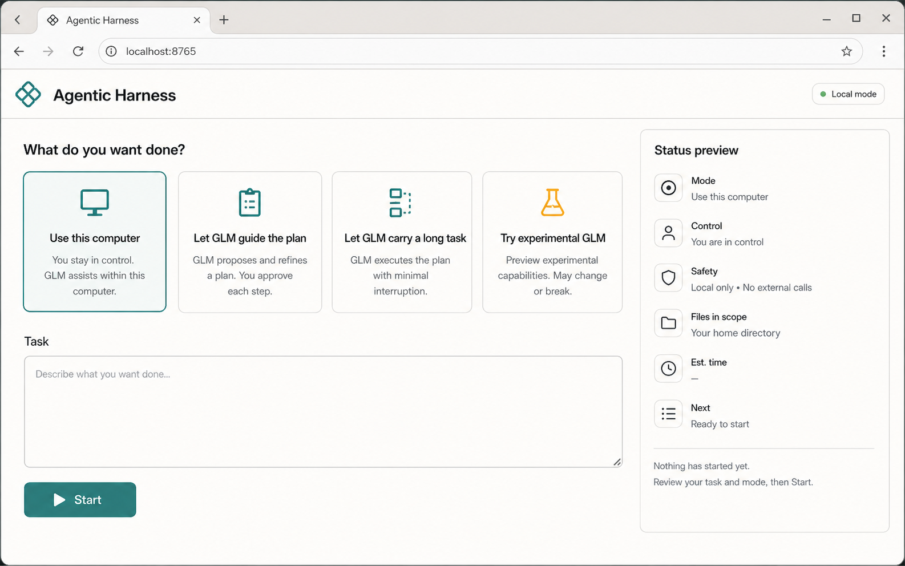
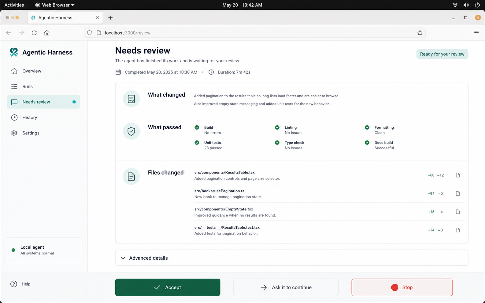
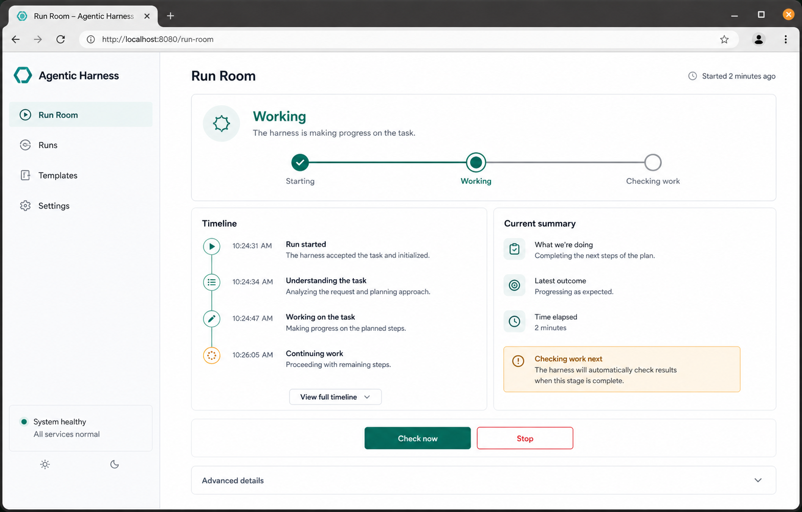

# GUI Design

## Purpose

Agentic Harness gives a non-programmer a calm local workbench for starting,
watching, and reviewing AI-assisted work. The main interface answers five
questions without requiring command-line or harness knowledge:

- What can I ask it to do?
- Which kind of help should I use?
- Is it working?
- Does it need me?
- What finished, passed, or remains blocked?

The GUI is a human layer over the existing review-oriented execution harness.
It does not remove evidence or safety gates. It moves technical evidence into
Advanced details so the default surface stays readable.

## Shipped Interface

The same workbench stacks into a single readable column at narrow widths. See
the [mobile capture](assets/agentic-harness-gui-mobile.png).

## Selected Direction

The selected visual direction is **Calm Local Operations**: a quiet, practical
local control panel with compact typography, visible state, restrained color,
and no terminal-shaped main surface.

Two supporting ideas are retained:

- **Friendly Assistant Control** contributes plain recovery and review text.
- **Power User Cockpit** contributes the progress trail, evidence groups, and
  disciplined Advanced details drawer.

The generated images below are concept references, not screenshots of the
shipped application. Their copy is illustrative; the product source is
authoritative.

### Calm Local Operations

The selected direction for mode choice, task entry, boundaries, and local
status.

### Friendly Assistant Control

Reference for review evidence and clear Accept, Continue, and Stop decisions.

### Power User Cockpit

Reference for long-running status, progress, and evidence hierarchy.

## Human Modes

The main interface exposes four choices. Backend route names are never part of
the mode cards.

| Mode | Use it for | Boundary |
| --- | --- | --- |
| Use this computer | Small, bounded local work | Best when one clear task should move |
| Let GLM guide the plan | Important local work that benefits from planning | Review remains part of completion |
| Let GLM carry a long task | Longer work that may need several passes | Results remain reviewable before acceptance |
| Try experimental GLM | Tiny sandbox checks on a newer route | Not the default for broad or important work |

## Screen States

The v1 GUI is a single-page workbench with state-based views rather than a
multi-step wizard.

### Start Work

- Plain-language task field.
- Four visible mode cards.
- Optional safe areas and expected checks.
- Start, Run checks, undo, and redo controls.
- Readiness gate showing whether another task can begin.

### Active Work

- Starting, Working, or Checking work status.
- Progress and current plain-language summary.
- Perceive, Plan, Act, Check, Review loop indicator.
- One safe manual action to check or move work forward.

### Needs Review

- Short outcome summary before technical evidence.
- Changed files, checks, and artifacts when available.
- Accept, Ask to continue, and Stop decisions.
- No automatic acceptance of broad or uncertain changes.

### Done, Blocked, And Stopped

- Done appears only after the harness reports accepted completion.
- Blocked explains the human decision or missing dependency.
- Stopped preserves evidence and reports that work is no longer running.

## Language Boundary

The default interface may use terms such as task, assistant, checking, review,
and blocked. It must not expose internal actor names, planner or executor names,
queue mechanics, raw JSON, shell commands, run directories, or Mode 3A wording.

Those details remain available in Advanced details for debugging and audit.
When a backend summary contains internal terminology, the API replaces the main
summary with a status-appropriate human explanation while retaining the raw
payload in Advanced details.

## Visual Rules

- Warm neutral canvas with charcoal text.
- Muted teal for progress and primary actions.
- Amber for review and attention states.
- Restrained red for destructive Stop actions.
- Cards use an 8px radius or less and are never nested.
- Compact headings inside work surfaces; no marketing hero treatment.
- No decorative gradients, blobs, terminal-black panels, or raw log surfaces.
- Layout remains usable at narrow mobile widths without horizontal overflow.

## Accessibility

- Semantic headings, labels, buttons, details, and dialog elements.
- Keyboard-reachable controls and visible focus treatment.
- Text accompanies every color-based status.
- Mode cards expose selection state to assistive technology.
- Long task text and local paths wrap instead of forcing horizontal scrolling.
- Motion remains limited and respects reduced-motion preferences.

## Decision Record

- Local browser GUI first; native wrappers can reuse it later.
- One visible task decision at a time.
- Technical evidence is retained but collapsed by default.
- Review gates remain real even under the no-babysitting policy.
- Static packaged HTML, CSS, and JavaScript are sufficient for v1 and avoid a
  separate Node or desktop runtime.
